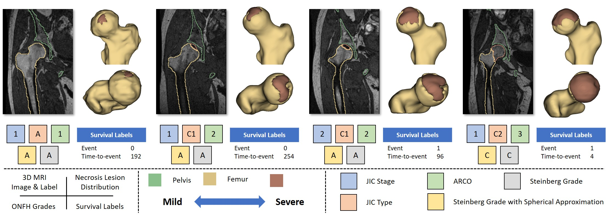
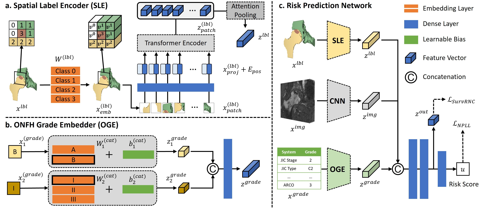

# FemoralCollapsePrediction

This is the implementation of MICCAI 2025 paper "Predicting Femoral Head Collapse Risk in Osteonecrosis Using Label Tokenization: A Multi-modality Survival Analysis Approach."

  

  

